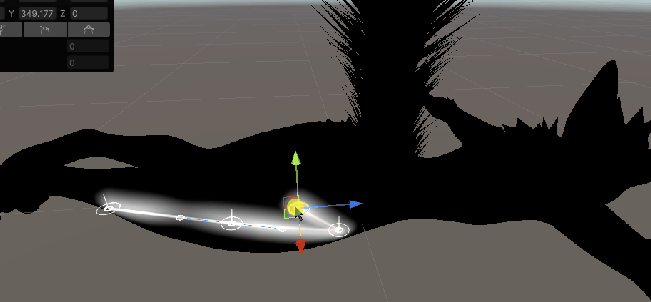
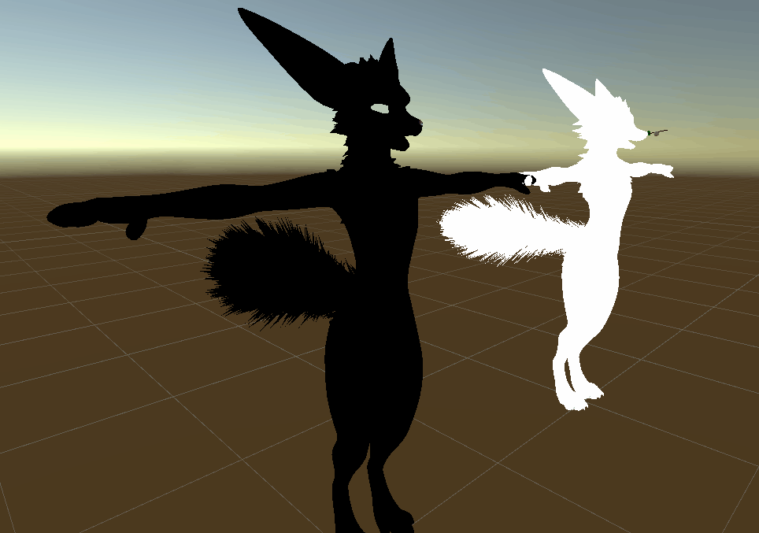

# AvaUtilTests-Unity

Abondoned utility project for avatars. Decided to not use unity for this so anything in here is public domain if you find it useful.

Has a few different implementations of AO baking in Burst jobs and Compute Shader.

Has a shader implementation of baking the SDF of a spline onto mesh via shader.

Has a Burst implementation of baking the 'Vertex Flow' of an avatar mesh. You specif a point, like the head, and it will walk vertex to vertex recording the direction it walked into the vertex color.

